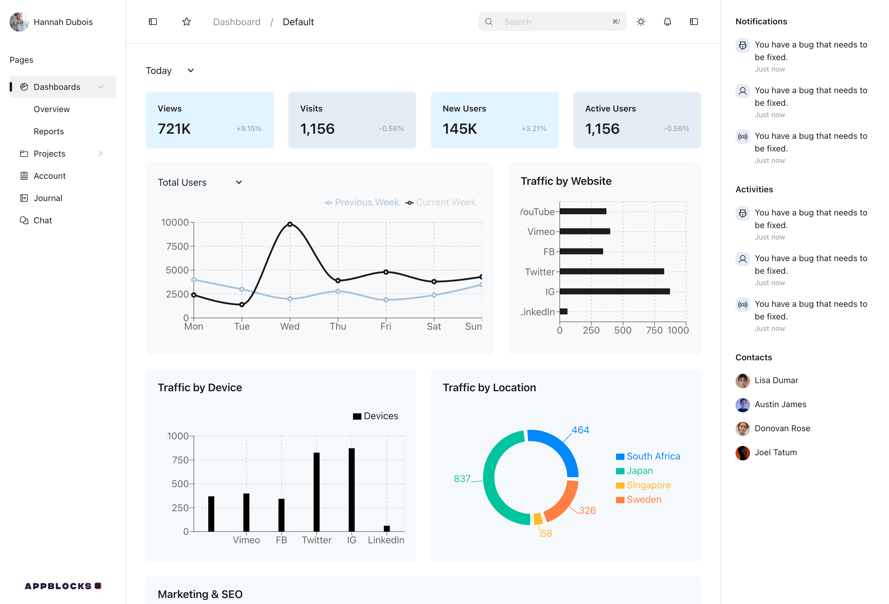

# Data Visualization Portfolio

A collection of dashboards, analytics projects, and visual explorations — designed to turn complex data into clarity. Each project emphasizes interactivity, performance, and storytelling through visuals.

---

## Featured Dashboards

### 1. Fleet Management Dashboard — *TFleet Logistics*
**Tech stack:** React, TypeScript, Recharts, FastAPI, PostgreSQL  
**Focus:** Real-time fleet performance and operational metrics  

**Highlights**
- Visualized truck utilization, delivery efficiency, and route performance.
- Built reusable chart components (line, bar, area) with type-safe data models.

**Built With**
- **React + TypeScript:** strongly typed dashboard components and API hooks.  
- **Recharts.js:** custom tooltips, gradient fills, and adaptive axis scaling.  

---

## Exploratory Data Projects

### • Data Dashboard Template
**Tools:** Tailwind, Recharts, React  
**Goal:** Reusable, themable data dashboard in React

[Open Demo](https://yogo-demo.vercel.app/)
[Open Source](https://github.com/od41/yogo-uiki)

---

## Tools & Techniques

**Visualization Libraries:** Recharts, D3.js
**Data Processing:** Pandas, SQL  
**Frontend Frameworks:** React, Next.js, Framer Motion  

---

> “Data visualization is not about decoration — it’s about compression. The right chart can replace a thousand words.”

